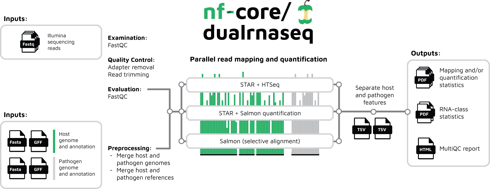

# nf-core/dualrnaseq

## Introduction

Dualrnaseq is a workflow designed to quantify simultaneous host and pathogen RNA-seq data. This has been initially tested with eukaryotic host organisms including Human and Mouse, and pathogens including *Salmonella enterica*, *Orientia tsutsugamushi*, *Streptococcus penumoniae*, and *Mycobacterium leprae*. The workflow should work with any eukaryotic and bacterial organisms with an available reference genome and annotation.

This has been built using [Nextflow](https://www.nextflow.io/), a workflow tool allowing scalable and reproducible workflows using containers, which can run across multiple computing infrastructures.

The workflow diagram below gives a simplified visual overview of how dualrnaseq has been designed.

Click [here](usage.md) for details on how to run the pipeline.

